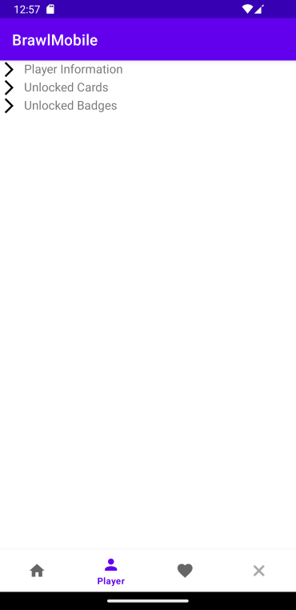
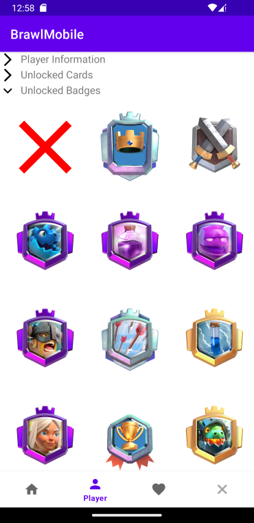
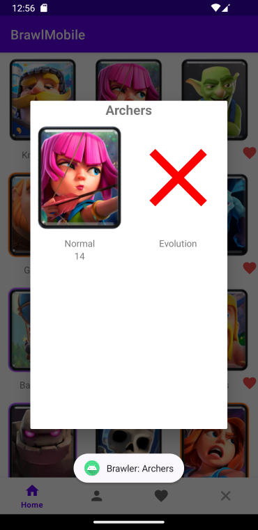

# Design dell'Interfaccia Utente

### StartActivity
Questa è la Activity da cui potersi muovere verso le Activity dedicate ai due giochi 

  

## Brawl Stars
### Brawl Home Activity
Questa Activity visualizza i Brawler presenti nel gioco

    

### Brawl Details Activity
Questa Activity visualizza info su un singolo Brawler

  

  

### Brawl Player Activity
Questa Activity visualizza info su un singolo Player

  

  

  

### Brawl Favourite Activity
Questa Activity visualizza info sui Brawler preferiti

  

## Clash Royale
### Clash Home Activity
Questa Activity visualizza le Carte presenti nel gioco

    

### Clash Player Activity
Questa Activity visualizza info su un singolo Player

  

  

  

  

### Clash Favourite Activity
Questa Activity visualizza info sulle Carte preferite

  

### Details Dialog Fragment
Questo Fragment visualizza info su una singola Carta, si apre al clic su una Carta in ClashHomeActivity

  

  

## Fragment in comune 
### Input Fragment
Questo Fragment serve per inserire il TAG di gioco

  

### Error Fragment
Questo Fragment serve per mostrare all'utente che qualcosa è andato storto, che ci sono errori e che l'app deve quindi essere riavviata

  

