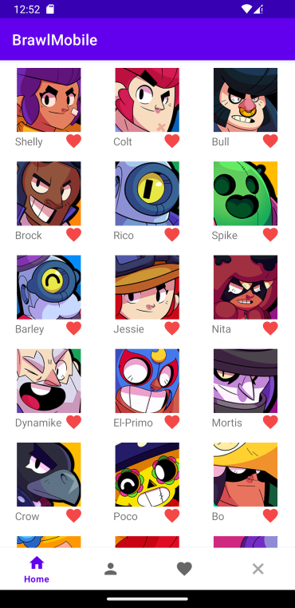

# BrawlMobile

# Scopo
La applicazione nasce per usare la API del gioco Brawl Stars, unico gioco mobile su cui regolarmente spendo il mio tempo libero. Il fatto che si possa interagire anche con la API di Clash Royale è venuto dopo aver già deciso il nome dell'app e per pura necessita (rispettare il requisito opzionale: Usare almeno due API). 

# Requisiti di Sistema
Per poter funzionare il device deve essere connesso ad internet. La versione minima di Android è la 26

# Tecnologie Utilizzate

Nel corso dello sviluppo di questo progetto Android, ho sfruttato una serie di librerie e tecnologie che mi hanno permesso di raggiungere gli obiettivi in modo efficiente e robusto. Di seguito sono elencate alcune delle principali tecnologie utilizzate:

1. **AndroidX Library e ConstraintLayout**: Ho utilizzato la libreria AndroidX per sfruttare le ultime funzionalità di Android e garantire la compatibilità con diverse versioni di Android. In particolare, ho utilizzato `androidx.core:core-ktx`, `androidx.appcompat:appcompat`, e `com.google.android.material:material` per garantire un'interfaccia utente moderna e coerente. Ho sfruttato `androidx.constraintlayout:constraintlayout` per creare layout flessibili e reattivi, consentendo una migliore adattabilità dell'interfaccia utente a diverse dimensioni di schermi.

2. **Moshi e Retrofit**: Ho utilizzato `com.squareup.moshi:moshi-kotlin` e `com.squareup.retrofit2:retrofit` per gestire la serializzazione e la deserializzazione dei dati e per effettuare chiamate RESTful al backend del servizio.

3. **Glide**: Ho adottato `com.github.bumptech.glide:glide` per il caricamento e la visualizzazione efficiente delle immagini all'interno dell'app, migliorando l'esperienza dell'utente.

4. **Jsoup**: Ho integrato `org.jsoup:jsoup` per l'estrazione di dati da pagine web, consentendo al progetto di recuperare informazioni da fonti esterne.

5. **ViewModel**: Ho utilizzato `androidx.lifecycle:lifecycle-viewmodel-ktx` per gestire i dati e il ciclo di vita delle componenti dell'interfaccia utente, garantendo una separazione pulita tra la logica dell'app e l'interfaccia utente.

6. **Room Database**: Ho sfruttato `androidx.room` per creare e gestire un database locale all'interno dell'app, consentendo la memorizzazione e la gestione efficiente dei dati.

# Funzionalità Principali
Visualizzare Brawler, visualizzre Carte e dettagli su entrambi.

Creare una lista di Brawler preferiti o una lista di Carte Preferite.

Visualizzare informazioni generali su un player di Brawl Stars (vengono visualizzate info sul player e i brawler sbloccati dal player).

Visualizzare informazioni generali su un player di Clash Royale (vengono visualizzate info sul player, le carte e i badge sbloccati dal player).

# Design dell'Interfaccia Utente

## StartActivity

  

## Home Activity

    

## DetailsActivity

  

  

## PlayerActiviy

  

  

  

## FavouriteActivity

  

# Architettura dell'App

## StartActivity

La `StartActivity` è la Activity iniziale da cui muoversi verso `BrawlHomeActivity` o `ClashHomeActivity`. Il suo scopo è di far partire una delle due activity al clic su uno dei due bottoni tramite un Intent() nel metodo onCreate(). Non necessita quindi di viewModel o Adapter in quanto è solo una activity di utilità

## HomeActivity:

La `BrawlHomeActivity` utilizza il ViewModel (`HomeActivityViewModel`) per gestire la logica dei dati e l'Adapter (`BrawlHomeAdapter`) per visualizzare i dati dei Brawler nella RecyclerView. In caso di errore, può visualizzare un `ErrorFragment`. I dati dei Brawler vengono recuperati dal repository (`BrawlerRepository`) tramite Retrofit.

La `ClashHomeActivity` utilizza il ViewModel (`HomeActivityViewModel`) per gestire la logica dei dati e l'Adapter (`ClashHomeAdapter`) per visualizzare i dati delle Carte nella RecyclerView. In caso di errore, può visualizzare un `ErrorFragment`. I dati delle Carte vengono recuperati dal repository (`CardRepository`) tramite Retrofit.

Ecco una descrizione della struttura di `BrawlHomeActivity` e `ClashHomeActivity` e dei componenti associati:

- **BrawlHomeActivity**: Questa è l'activity responsabile di visualizzare i dati dei Brawler. La classe contiene i seguenti componenti:

  - `viewModel`: Un'istanza del ViewModel chiamato `HomeActivityViewModel` utilizzato per gestire la logica dei dati e l'interfaccia utente relativi alla visualizzazione dei Brawler.
  
  - `recyclerView`: Una RecyclerView utilizzata per visualizzare i dati dei Brawler.

  - `adapter`: Un Adapter chiamato `BrawlHomeAdapter` utilizzato per popolare la RecyclerView con i dati dei Brawler.

  - `TAG`: Una stringa utilizzata per scopi di logging.

  - `onCreate(savedInstanceState: Bundle?)`: Un metodo chiamato durante la creazione dell'activity che inizializza la UI e carica i dati dei Brawler.

  - `startErrorFragment(errorMessage: String)`: Un metodo per avviare un `ErrorFragment` con un messaggio di errore specifico.

  - `onClickViewInfo(model: Any)`: Un metodo per gestire il clic su un elemento per visualizzare ulteriori informazioni.

  - `onClickAddToFavourite(model: Any)`: Un metodo per gestire l'aggiunta di un Brawler ai preferiti.

- **ClashHomeActivity**: Questa è l'activity responsabile di visualizzare i dati delle Carte. La classe contiene i seguenti componenti:

  - `viewModel`: Un'istanza del ViewModel chiamato `HomeActivityViewModel` utilizzato per gestire la logica dei dati e l'interfaccia utente relativi alla visualizzazione delle Carte.
  
  - `recyclerView`: Una RecyclerView utilizzata per visualizzare i dati delle Carte.

  - `adapter`: Un Adapter chiamato `ClashHomeAdapter` utilizzato per popolare la RecyclerView con i dati delle Carte.

  - `TAG`: Una stringa utilizzata per scopi di logging.

  - `onCreate(savedInstanceState: Bundle?)`: Un metodo chiamato durante la creazione dell'activity che inizializza la UI e carica i dati delle Carte.

  - `startErrorFragment(errorMessage: String)`: Un metodo per avviare un `ErrorFragment` con un messaggio di errore specifico.

  - `onClickViewInfo(model: Any)`: Un metodo per gestire il clic su un elemento per visualizzare ulteriori informazioni.

  - `onClickAddToFavourite(model: Any)`: Un metodo per gestire l'aggiunta di una Carta ai preferiti.

- **ErrorFragment**: Questa è una classe Fragment utilizzata per visualizzare messaggi di errore all'interno delle activity. I principali componenti includono:

  - `newInstance(errorMessage: String)`: Un metodo statico per creare un'istanza di `ErrorFragment` con un messaggio di errore specifico.

  - `onCreateView(inflater: LayoutInflater, container: ViewGroup?, savedInstanceState: Bundle?)`: Un metodo per creare la vista del Fragment.

  - `onViewCreated(view: View, savedInstanceState: Bundle?)`: Un metodo chiamato dopo che la vista è stata creata, utile per impostare il messaggio di errore nella vista.

- **HomeActivityViewModel**: Questo ViewModel gestisce la logica dei dati per `BrawlHomeActivity` e `ClashHomeActivity`. Le sue funzioni principali includono:

  - `brawlerRepository` e `cardRepository`: Le istanze dei repository (`BrawlerRepository` e `CardRepository`) utilizzate per ottenere dati dai servizi web.

  - `TAG`: Una stringa utilizzata per scopi di logging.

  - `brawlerImagesUrl` e `clashImageUrl`: Stringhe contenenti gli URL base per le immagini dei Brawler e delle Carte.

  - `maxSize` e `totalLoaded`: Variabili per gestire la paginazione o il caricamento dei dati.

  - `_brawlers` e `cards`: MutableLiveData contenenti le liste dei Brawler e delle carte.

  - `errorLiveData`: MutableLiveData utilizzata per gestire i messaggi di errore.

  - `brawlers`: LiveData contenente la lista dei Brawler, utilizzata dall'`HomeAdapter` per popolare la RecyclerView.

  - `getBrawlers()`: Metodo per recuperare i dati dei Brawler dal repository.

  - `getCards()`: Metodo per recuperare i dati delle Carte dal repository.

  - `clearErrorMessage()`: Metodo per cancellare i messaggi di errore.

- **BrawlerRepository** e **CardRepository**: Queste classi sono responsabili del recupero dei dati dei Brawler e delle Carte da fonti esterne. Entrambi fanno uso di Retrofit per effettuare richieste HTTP ai rispettivi servizi web.

- **BrawlHomeAdapter**: Questa classe è un Adapter utilizzato per popolare la RecyclerView nella `BrawlHomeActivity`. I componenti principali includono:

  - `brawlerList`: La lista dei Brawler da visualizzare.

  - `context`: Il contesto dell'applicazione.

  - `clickListener`: Un'istanza di `ClickListener` utilizzata per gestire le azioni quando si fa clic su un elemento.

  - `setBrawlers(data: List<BrawlerModel>)`: Un metodo per impostare la lista di Brawler da visualizzare nella RecyclerView.

  - `onCreateViewHolder(parent: ViewGroup, viewType: Int)`: Un metodo per creare una nuova istanza di ViewHolder quando necessario.

  - `getItemCount()`: Un metodo per ottenere il numero totale di elementi nella lista dei Brawler.

  - `onBindViewHolder(holder: ViewHolder, position: Int)`: Un metodo per associare i dati di un elemento specifico alla vista ViewHolder.

- **ClashHomeAdapter**: Questa classe è un Adapter utilizzato per popolare la RecyclerView nella `ClashHomeActivity`. I componenti principali includono:

  - `cards`: La lista delle Carte da visualizzare.

  - `context`: Il contesto dell'applicazione.

  - `clickListener`: Un'istanza di `ClickListener` utilizzata per gestire le azioni quando si fa clic su un elemento.

  - `setCard(data: List<CardModel>)`: Un metodo per impostare la lista di Brawler da visualizzare nella RecyclerView.

  - `onCreateViewHolder(parent: ViewGroup, viewType: Int)`: Un metodo per creare una nuova istanza di ViewHolder quando necessario.

  - `getItemCount()`: Un metodo per ottenere il numero totale di elementi nella lista delle Carte.

  - `onBindViewHolder(holder: ViewHolder, position: Int)`: Un metodo per associare i dati di un elemento specifico alla vista ViewHolder.

- **ClickListener**: Questa interfaccia definisce le azioni da eseguire quando si fa clic su un elemento negli `HomeAdapter`, come visualizzare informazioni dettagliate o aggiungere ai preferiti.

- **RetrofitBrawlStars** e **RetrofitClashRoyale**: Queste classi forniscono istanze di Retrofit configurate per le richieste relative a Brawl Stars e Clash Royale. Configurano anche OkHttpClient per accettare un certificato del server personalizzato.

## FavouriteActivity:

Le due `FavouriteActivity` consentono agli utenti di visualizzare i loro Brawler preferiti  o Carte preferite e di rimuoverli dalla lista dei preferiti in base al nome. Il ViewModel (`FavouriteActivityViewModel`) gestisce l'interazione tra l'activity e il repository dei preferiti (`FavouriteRepository`), mentre l'Adapter (`FavouriteAdapter`) è responsabile della visualizzazione dei dati nella RecyclerView. I dati sono archiviati localmente nel database utilizzando `BrawlerDao` e `CardDao`.

Ecco una descrizione approfondita della struttura delle `FavouriteActivity` e dei componenti associati:

- **FavouriteActivity** (`BrawlFavouriteActivity` o `ClashFavouriteActivity`): Questa è un'activity che gestisce la visualizzazione dei Brawler preferiti o delle Carte preferite. La classe contiene i seguenti componenti:

  - `viewModel`: Un'istanza del ViewModel chiamato `FavouriteActivityViewModel` utilizzato per gestire la logica dei dati e l'interfaccia utente relativi alla visualizzazione dei preferiti.

  - `recyclerView`: Una RecyclerView utilizzata per visualizzare i Brawler preferiti o le Carte preferite.

  - `adapter`: Un Adapter chiamato `FavouriteAdapter` utilizzato per popolare la RecyclerView con i dati dei Brawler preferiti o delle Carte preferite.

  - `TAG`: Una stringa utilizzata per scopi di logging.

  - `onCreate(savedInstanceState: Bundle?)`: Un metodo chiamato durante la creazione dell'activity che inizializza la UI e carica i dati dei Brawler preferiti o delle carte preferite.

  - `deleteFromFavourites(name: String)`: Un metodo che consente di rimuovere un Brawler o una Carta dai preferiti in base al nome.

- **FavouriteAdapter**: Questa classe è un Adapter utilizzato per popolare la RecyclerView nelle due `FavouriteActivity`. I componenti principali includono:

  - `context`: Il contesto dell'applicazione.

  - `clickListener`: Un'istanza di `ClickListener` utilizzata per gestire l'azione di rimozione di un Brawler o una Carta dai preferiti.

  - `favouriteItem`: Una lista di oggetti che rappresentano i Brawler preferiti o le Carte preferite.

  - `ViewHolder`: Una classe interna responsabile di mantenere i riferimenti agli elementi della vista per ciascun elemento nella RecyclerView.

  - `onCreateViewHolder(parent: ViewGroup, viewType: Int)`: Un metodo per creare una nuova istanza di ViewHolder quando necessario.

  - `getItemCount()`: Un metodo per ottenere il numero totale di elementi nella lista dei preferiti.

  - `onBindViewHolder(holder: ViewHolder, position: Int)`: Un metodo per associare i dati di un elemento specifico alla vista ViewHolder.

  - `setFavouriteItem(item: List<Any>)`: Un metodo per impostare la lista di Brawler o Carte preferiti da visualizzare nella RecyclerView.

- **ClickListener**: Questa interfaccia definisce un metodo per rimuovere un Brawler o una Carta dai preferiti in base al nome (`deleteFromFavourites(name: String)`).

- **FavouriteActivityViewModel**: Questo ViewModel gestisce la logica dei dati relativi alla visualizzazione dei preferiti. Le funzioni principali includono:

  - `favouriteRepository`: Un'istanza di `FavouriteRepository` utilizzata per accedere ai dati dei preferiti.

  - `brawlerDao` e `cardDao`: Interfacce per accedere ai dati dei Brawler e delle Carte preferiti nel database locale.

  - `allFavouriteBrawlers` e `allFavouriteCards`: LiveData contenenti le liste dei Brawler preferiti e delle Carte preferite.

  - `insertFavouriteBrawler(favouriteBrawler: BrawlerEntity)` e `deleteBrawler(name: String)`: Metodi per inserire o rimuovere un Brawler dai preferiti.

  - `insertFavouriteCard(favouriteCard: CardEntity)` e `deleteCard(name: String)`: Metodi per inserire o rimuovere una Carta dai preferiti.

- **FavouriteRepository**: Questa classe è responsabile di fornire un'astrazione per accedere ai dati dei preferiti. Utilizza `brawlerDao` e `cardDao` per interagire con il database locale. Le funzioni principali includono:

  - `getAllBrawlers()`: Restituisce una LiveData contenente la lista dei Brawler preferiti.

  - `deleteBrawlerByName(name: String)`: Elimina un Brawler dai preferiti in base al nome.

  - `insertBrawler(brawler: BrawlerEntity)`: Inserisce un Brawler tra i preferiti.

  - `getAllCards()`: Restituisce una LiveData contenente la lista delle Carte preferite.

  - `deleteCardByName(name: String)`: Elimina una Carta dai preferiti in base al nome.

  - `insertCard(card: CardEntity)`: Inserisce una Carta tra i preferiti.

- **BrawlerDao** e **CardDao**: Queste interfacce definiscono i metodi per accedere ai dati dei Brawler e delle Carte nel database locale, come ottenere tutti i Brawler o le Carte, eliminarli per nome, inserirli per nome.

- **AppDatabase**: Questa classe è responsabile della creazione dell'istanza del database locale e fornisce metodi per ottenere i DAO per i Brawler e le Carte preferiti.

## PlayerActivity:

La `BrawlPlayerActivity` è l'elemento dell'applicazione dedita alla visualizzazione di info su un player di BrawlStars. Utilizza il ViewModel (`PlayerActivityViewModel`) per gestire la logica dei dati e gli Adapter (`PlayerAdapterInfo` e `PlayerAdapterBrawlersUnlocked`) per visualizzare le informazioni del giocatore nelle RecyclerView. L`InputFragment` è utilizzato per inserire il tag del giocatore e per gestire eventuali errori nell'input. Le informazioni del giocatore vengono recuperate dal repository (`PlayerRepository`) tramite Retrofit.

La `ClashPlayerActivity` è l'elemento dell'applicazione dedita alla visualizzazione di info su un player di Clash Royale. Utilizza il ViewModel (`PlayerActivityViewModel`) per gestire la logica dei dati e gli Adapter (`ClashPlayerAdapterInfo`, `ClashPlayerAdapterCardUnlocked` e `ClashPlayerAdapterBadgeUnlocked`) per visualizzare le informazioni del giocatore nelle RecyclerView. L`InputFragment` è utilizzato per inserire il tag del giocatore e per gestire eventuali errori nell'input. Le informazioni del giocatore vengono recuperate dal repository (`PlayerRepository`) tramite Retrofit.

Ecco una descrizione della struttura di `BrawlPlayerActivity` e `ClashPlayerActivity` e dei componenti associati:

- **BrawlPlayerActivity**: Questa è l'activity responsabile di visualizzare le informazioni su giocatori, tra cui informazioni generali e Brawlers sbloccati. La classe contiene i seguenti componenti:

  - `viewModel`: Un'istanza del ViewModel chiamato `PlayerActivityViewModel` utilizzato per gestire la logica dei dati e l'interfaccia utente relative alle informazioni del giocatore.

  - `recyclerViewInfo` e `recyclerViewBrawlers`: Due RecyclerView utilizzate per visualizzare le informazioni generali del giocatore e la lista dei Brawlers sbloccati, rispettivamente.

  - `adapterInfo` e `adapterBrawlersUnlocked`: Due Adapter (`PlayerAdapterInfo` e `PlayerAdapterBrawlersUnlocked`) utilizzati per popolare le RecyclerView con i dati delle informazioni del giocatore e dei Brawlers sbloccati.

  - `TAG`: Una stringa utilizzata per scopi di logging.

  - `expandPlayerInfo` e `expandUnlocked`: Elementi UI utilizzati per espandere/contrarre sezioni di informazioni nel layout.

  - `drawableArrowForward` e `drawableArrowDown`: Drawable per le icone delle frecce che indicano l'espansione/contrazione delle sezioni.

  - `inputFragment`: Un fragment chiamato `InputFragment` utilizzato per inserire il tag del giocatore.

  - `onCreate(savedInstanceState: Bundle?)`: Un metodo chiamato durante la creazione dell'activity che inizializza la UI e carica le informazioni del giocatore.

  - `startInputFragment()`: Un metodo per avviare l`InputFragment` per inserire il tag del giocatore.

- **ClashPlayerActivity**: Questa è l'activity responsabile di visualizzare le informazioni su giocatori, tra cui informazioni generali, Carte e Badge sbloccati. La classe contiene i seguenti componenti:

  - `viewModel`: Un'istanza del ViewModel chiamato `PlayerActivityViewModel` utilizzato per gestire la logica dei dati e l'interfaccia utente relative alle informazioni del giocatore.

  - `recyclerViewInfo`, `recyclerViewCards` e `recyclerViewBadges`: Tre RecyclerView utilizzate per visualizzare le informazioni generali del giocatore, la lista delle Carte sbloccate, la lista dei Badge sbloccati, rispettivamente.

  - `adapterPlayerInfo`, `adapterCardUnlocked` e `adapterBadgeUnlocked` : Tre Adapter (`ClashPlayerAdapterInfo`, `ClashPlayerAdapterCardUnlocked` e `ClashPlayerAdapterBadgeUnlocked`) utilizzati per popolare le RecyclerView con i dati delle informazioni del giocatore, delle Carte sbloccate e dei Badge sbloccati.

  - `TAG`: Una stringa utilizzata per scopi di logging.

  - `expandPlayerInfo`, `expandUnlockedCards` e `expandUnlockedBadges` : Elementi UI utilizzati per espandere/contrarre sezioni di informazioni nel layout.

  - `drawableArrowForward` e `drawableArrowDown`: Drawable per le icone delle frecce che indicano l'espansione/contrazione delle sezioni.

  - `inputFragment`: Un fragment chiamato `InputFragment` utilizzato per inserire il tag del giocatore.

  - `onCreate(savedInstanceState: Bundle?)`: Un metodo chiamato durante la creazione dell'activity che inizializza la UI e carica le informazioni del giocatore.

  - `startInputFragment()`: Un metodo per avviare l`InputFragment` per inserire il tag del giocatore.

- **PlayerActivityViewModel**: Questo ViewModel gestisce la logica dei dati per la `BrawlPlayerActivity` e `ClashPlayerActivity`. Le sue funzioni principali includono:

  - `playerRepository`: Un'istanza del repository chiamato `PlayerRepository` utilizzato per ottenere dati dal servizio web.

  - `TAG`: Una stringa utilizzata per scopi di logging.

  - `brawlPlayerInfo` e `clashPlayerInfo`: MutableLiveData contenenti le informazioni generali del giocatore per Brawl Stars e Clash Royale.

  - `playerBrawlersUnlocked`, `playerCardsUnlocked`, e `playerBadgesUnlocked`: MutableLiveData contenenti le liste di Brawlers sbloccati, Carte sbloccate e Badge sbloccati.

  - `errorLiveData`: MutableLiveData utilizzata per gestire i messaggi di errore.

  - `getBrawlPlayerInfo(tag: String)`: Metodo per recuperare le informazioni del giocatore di Brawl Stars dal repository.

  - `getClashPlayerInfo(tag: String)`: Metodo per recuperare le informazioni del giocatore di Clash Royale dal repository.

  - `clearErrorMessage()`: Metodo per cancellare i messaggi di errore.

- **PlayerRepository**: Questa classe è responsabile del recupero delle informazioni del giocatore da fonti esterne. Fa uso di Retrofit per effettuare richieste HTTP ai rispettivi servizi web per Brawl Stars e Clash Royale.

- **PlayerAdapterInfo** e **PlayerAdapterBrawlersUnlocked**: Queste classi sono Adapter utilizzati per popolare le RecyclerView con i dati delle informazioni generali del giocatore e dei Brawlers sbloccati. Entrambi contengono metodi per impostare i dati nelle RecyclerView.
-
- **ClashPlayerAdapterInfo**, **ClashPlayerAdapterCardUnlocked** e **ClashPlayerAdapterBadgeUnlocked**: Queste classi sono Adapter utilizzati per popolare le RecyclerView con i dati delle informazioni generali del giocatore, delle carte sbloccate, dei badge sbloccati. Contengono metodi per impostare i dati nelle RecyclerView.

- **InputFragment**: Questo fragment è utilizzato per inserire il tag del giocatore e può visualizzare un messaggio di errore se il tag inserito non è valido. Ha un'associazione con il ViewModel per gestire l'input del tag.

- **RetrofitBrawlStars** e **RetrofitClashRoyale**: Queste classi forniscono istanze di Retrofit configurate per le richieste relative a Brawl Stars e Clash Royale. Configurano anche OkHttpClient per accettare un certificato del server personalizzato.

## DetailsActivity

La `BrawlDetailsActivity` è usata per visualizzare dettagli specifici su un elemento. Il ViewModel (`DetailsActivityViewModel`) gestisce la logica dei dati e l'Adapter (`DetailsAdapter`) popola la RecyclerView con i dettagli. In caso di errore, l'applicazione può avviare un `ErrorFragment` per visualizzare un messaggio di errore appropriato.

Ecco una descrizione della struttura di `BrawlDetailsActivity` e dei componenti associati:

- **BrawlDetailsActivity**: Questa è l'activity principale responsabile di visualizzare i dettagli relativi a un elemento specifico del gioco Brawl Stars. La classe contiene i seguenti componenti:

  - `viewModel`: Un'istanza del ViewModel chiamato `DetailsActivityViewModel` utilizzato per gestire la logica dei dati e l'interfaccia utente relativi ai dettagli.

  - `recyclerView`: Una RecyclerView utilizzata per visualizzare i dettagli, che possono includere testo e immagini.

  - `adapter`: Un Adapter chiamato `DetailsAdapter` utilizzato per popolare la RecyclerView con i dati relativi ai dettagli.

  - `TAG`: Una stringa utilizzata per scopi di logging.

  - `onCreate(savedInstanceState: Bundle?)`: Un metodo chiamato durante la creazione dell'activity che inizializza la UI e carica i dettagli.

  - `startErrorFragment(errorMessage: String)`: Un metodo per avviare un `ErrorFragment` in caso di errore.

- **ErrorFragment**: Questo è un Fragment utilizzato per visualizzare messaggi di errore all'interno dell'activity. Contiene metodi per creare la sua istanza, creare la vista e gestire l'interfaccia utente.

- **DetailsActivityViewModel**: Questo ViewModel gestisce la logica dei dati per `BrawlDetailsActivity`. Le sue funzioni principali includono:

  - `textRepository`: Un'istanza del repository chiamato `TextRepository` utilizzato per ottenere dati di testo da una fonte web.

  - `urlRepository`: Un'istanza del repository chiamato `UrlRepository` utilizzato per ottenere URL di immagini da una fonte web.

  - `TAG`: Una stringa utilizzata per scopi di logging.

  - `webUrls` e `webText`: MutableLiveData contenenti i dati relativi agli URL delle immagini e al testo recuperato dalla fonte web.

  - `errorLiveData`: MutableLiveData utilizzata per gestire i messaggi di errore.

  - `getWebText(name: String)`: Metodo per recuperare il testo dalla fonte web.

  - `getWebUrls(name: String)`: Metodo per recuperare gli URL delle immagini dalla fonte web.

  - `clearErrorMessage()`: Metodo per cancellare i messaggi di errore.

- **TextRepository** e **UrlRepository**: Queste classi sono responsabili del recupero dei dati dalla fonte web. Entrambe contengono metodi per ottenere dati sotto forma di Flow, che rappresenta una sequenza di valori asincroni.

- **RetrofitWeb**: Questa classe fornisce un'istanza di Retrofit configurata per effettuare richieste HTTP alla fonte web specifica.

- **DetailsAdapter**: Questa classe è un Adapter utilizzato per popolare la RecyclerView con i dati relativi ai dettagli. Contiene metodi per impostare i dati, inclusi testo e immagini, nelle RecyclerView.

# Implementazione Tecnica
Entrambe le API richiedono un IP a cui associare una API_KEY. Di conseguenza ho creato un server nginx su una istanza di GCE con un IP esterno pubblico. Così facendo ho creato due API_KEY, una per ogni API, sull'IP esterno della istanza di GCE risolvendo così il limite dell'IP da associare alla chiave

# Note di Sviluppo
- Nel `BrawlerRepository` ho effettuato richieste API con paginazione per dividere il carico di una singola richiesta in due richieste, non ho potuto fare lo stesso in `CardRepository` in quanto, pur avendo la possibilità di fare paginazione, la API restituisce sempre l'intero dataset anche usando il parametro 'limit'.
- `ErrorFragment`: a prescindere dall'errore riscontrato questo viene avviato con un messaggio al centro uguale a 'strings/fragment_error_txt'. Al di sotto è presente una TextView in cui c'è scritto l'errore vero e proprio che ha causato l'apparizione del fragment.
- `DetailsDialogFragment`: Questo DialogFragment viene usato per visualizzare info dettagliate sulle Carte. Per i Brawler ho invece creato la `BrawlerDetailsActivity`
- Caricamento immagini: l'applicazione fa largo uso di Glide per il caricamento delle immagini, al di sopra di ognuna di esse vi è una ProgressBar che verrà nascosta al caricamento dell'immagine, se l'immagine non viene caricata correttamente viene inserito 'R.drawable.ic_delete'

# Conclusioni
Questo progetto mi ha permesso di mettere a frutto non solo ciò che ho potuto apprendere durante le lezioni ma anche ciò che abbiamo affrontato in altri corsi. 
Sono orgoglioso del risultato ottenuto, mi piacerebbe continuare a migliorare la app per sfruttare a pieno i dati che le API permettono di manipolare